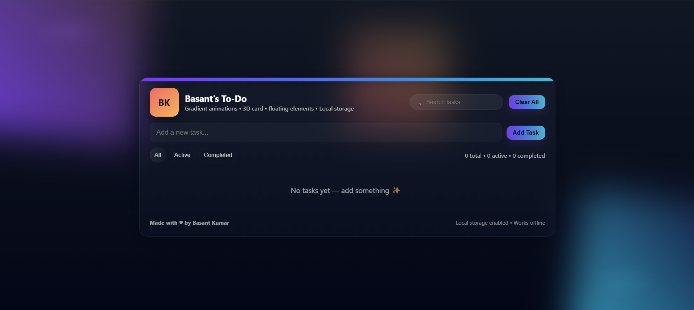

# TODO App

A simple, user-friendly TODO application built to help you organize your tasks and boost productivity. This project demonstrates core concepts of frontend development, state management, and CRUD operations.



## 🚀 Live Demo

[View Live App](https://basantkr762.github.io/todo/)

## Features

- ✍️ **Add Tasks**: Quickly add new tasks to your TODO list.
- ✅ **Mark Complete**: Easily mark tasks as completed.
- 🗑️ **Delete Tasks**: Remove tasks you no longer need.
- ✏️ **Edit Tasks**: Update your tasks as requirements change.
- 🎨 **Responsive Design**: Optimized for mobile and desktop.

## Getting Started

### Clone the repository

```bash
git clone https://github.com/basantkr762/todo.git
cd todo
```

### Install dependencies

```bash
npm install
```

### Run locally

```bash
npm start
```

## Project Structure

```
todo/
├── index.html
├── screenshot.png
└── README.md
```

## Technologies Used

- React (or Vanilla JS, depending on your implementation)
- CSS
- HTML

## Contributing

Pull requests are welcome! For major changes, please open an issue first to discuss what you would like to change.

## License

This project is licensed under the [MIT License](LICENSE).

## Author

Made with ❤️ by [basantkr762](https://github.com/basantkr762)

---

**Screenshot:**  


**Live Link:**  
[https://basantkr762.github.io/todo/](https://basantkr762.github.io/todo/)
